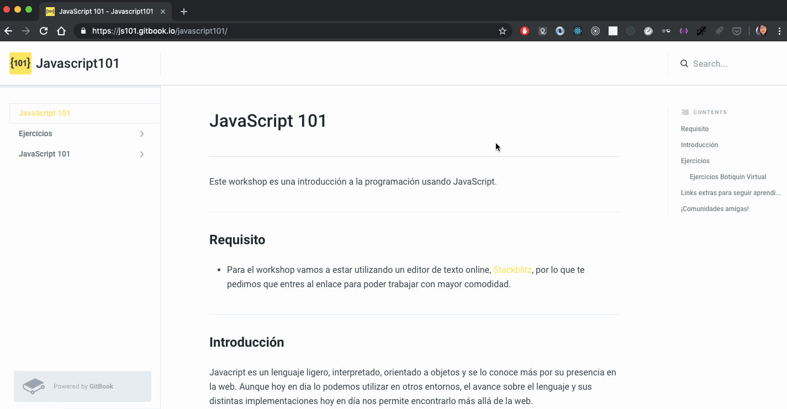

# JavaScript 101

Este workshop es una introducción a la programación usando JavaScript.

## Requisito

* Para el workshop vamos a estar utilizando un editor de texto online, [Stackblitz](https://stackblitz.com/fork/javascript101), por lo que te pedimos que entres al enlace para poder trabajar con mayor comodidad.
* Antes de empezar a trabajar debemos cambiar algunas configuraciones para poder realizar los ejercicios.
  * Vamos a ir a la configuración de stackblitz y cambiar el `Hot Reload Trigger`, si clickeamos esta opción se va a expandir un dropdown(lista), en el mismo elegimos la opción `Save`. Esto va a hacer que el editor se recargue solo cuando guardamos los cambios y no cada vez que realizamos uno. Para poder ver la diferencia podes elegir la opción `Edit(auto)` y ver el comportamiento.
  * Luego de esto vamos a volver al proyecto y ver que tenemos una carpeta `ejercicios` donde se encuentran los archivos para que puedas seguir con el workshop.
  
Acá te dejamos un GIF con los pasos a seguir.

## Introducción

Javacript es un lenguaje ligero, interpretado, orientado a objetos y se lo conoce más por su presencia en la web. Aunque hoy en dia lo podemos utilizar en otros entornos, el avance sobre el lenguaje y sus distintas implementaciones hoy en día nos permite encontrarlo más allá de la web.

Para conocer más sobre la historia y los fundamentos de Javascript podes empezar por acá: [MDN](https://developer.mozilla.org/es/docs/Web/JavaScript)

[Empezar con el workshop](ejercicios/conceptuales/01.md)

## Ejercicios

1. [alert\(\)](ejercicios/conceptuales/01.md)
2. [Números, Cadenas de Texto y Booleanos](ejercicios/conceptuales/02.md)
3. [Variables](ejercicios/conceptuales/03.md)
4. [Operadores](ejercicios/conceptuales/04.md)
5. [Condicionales](ejercicios/conceptuales/05.md)
6. [prompt\(\)](ejercicios/conceptuales/06.md)
7. [Funciones](ejercicios/conceptuales/07.md)
8. [Ejercicio Integrador](ejercicios/conceptuales/08.md)

### Ejercicios Botiquín Virtual

1. [Variables](ejercicios/botiquin/1_variables.md)
2. [Operadores y Expresiones](ejercicios/botiquin/2_operadores_expresiones.md)
3. [Arrays](ejercicios/botiquin/3_arrays.md)
4. [Estructuras de control](ejercicios/botiquin/4_estructuras_control.md)
5. [Objetos](ejercicios/botiquin/5_objetos.md)
6. [Funciones](ejercicios/botiquin/6_funciones.md)
7. [Aplicación Web](ejercicios/botiquin/7_aplicacion_web.md)

## Links extras para seguir aprendiendo

1. [JavaScript para gatos](https://jsparagatos.com/)
2. [Free Code Camp BA - Introducción a JavaScript](https://github.com/nhsz/intro-js)
3. [NodeSchool.io - JavaScripting](https://github.com/workshopper/javascripting)
4. [Introducción a JavaScript en la web](http://librosweb.es/libro/javascript/)
5. [Platzi - Curso de Programación básica](https://platzi.com/cursos/programacion-basica/)
6. [Eloquent JavaScript en español](http://hectorip.github.io/Eloquent-JavaScript-ES-online/)
7. [Aprende ECMAScript 6](https://carlosazaustre.es/ecmascript-6-el-nuevo-estandar-de-javascript/)
8. [Mozilla - Clases en ECMAScript 6](https://developer.mozilla.org/es/docs/Web/JavaScript/Referencia/Classes)
9. [Desafíos de CourseIT](https://courseit.com.ar/desafios)

## ¡Comunidades amigas!

* [WorkshopsJS](https://github.com/workshopsjs)
* [freeCodeCamp BA](https://freecodecampba.org/)
* [Chicas Programando](http://chicasprogramando.com/)
* [Women Who Code Buenos Aires](https://www.womenwhocode.com/buenosaires)

